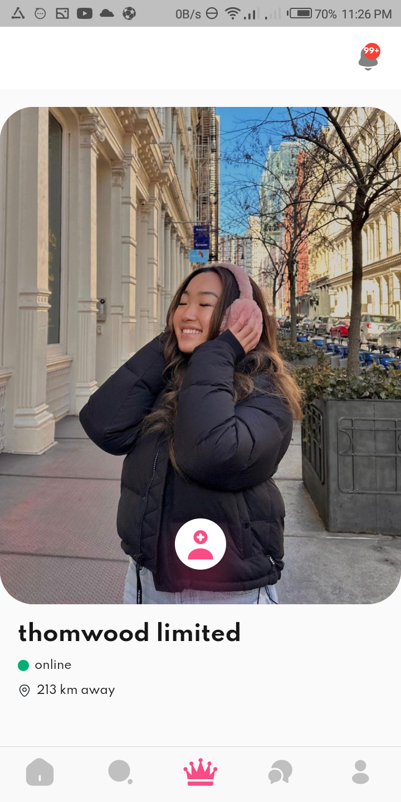
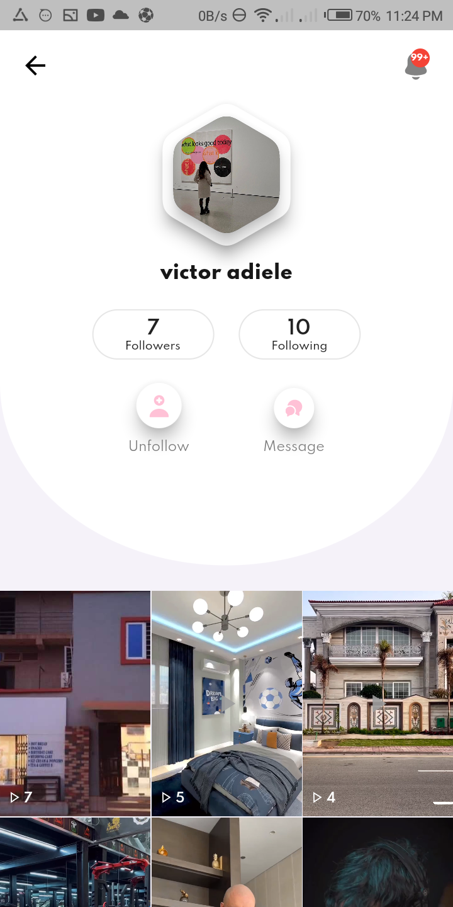
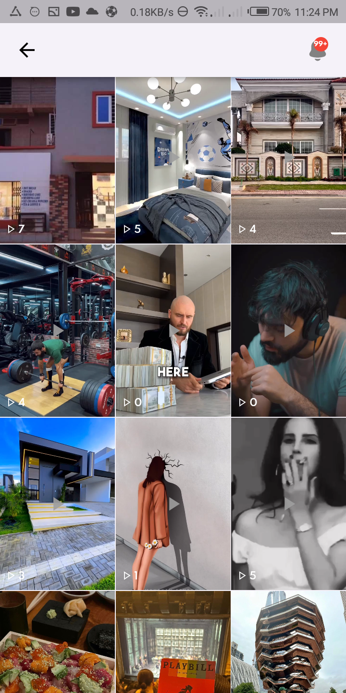

# makanaki

A social networking platform for individuals and businesses for africa
!. Full auth (email, otp )
2. feed
3. like
4. comment
5. like comment
6. swipe to find user
7. distance a user is in km
8. messaging
9. post buttons
10. business edges
11. download posts/ save post to gallery
12. post image or video
13. search
14. and much more....

above is the user swipe screen...

above screen is the fyp (videos and images)

above screen is the chat screen 

above screens are the profile screen 
